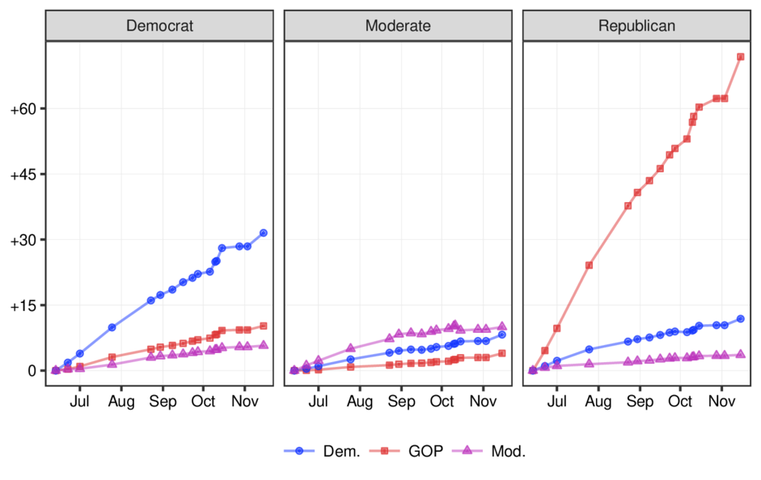
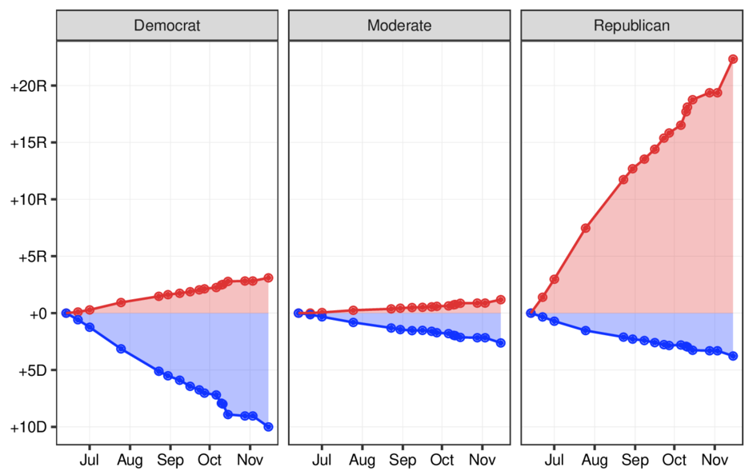
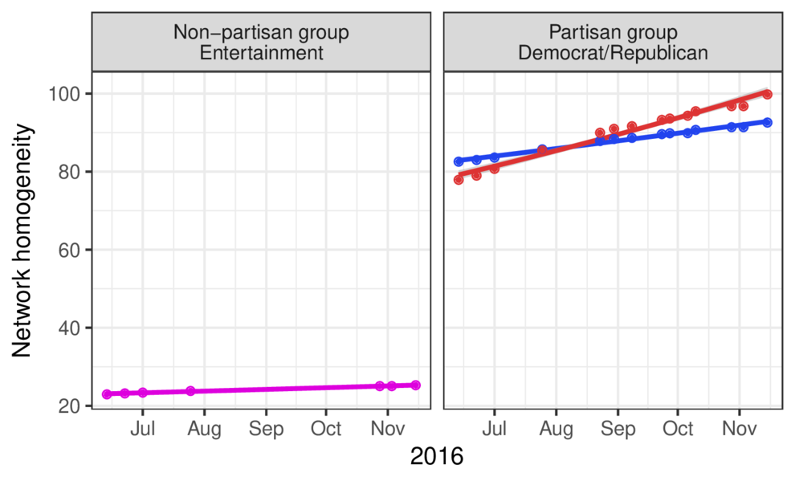

```{r setup, include=FALSE}
knitr::opts_chunk$set(
  echo = TRUE,
  eval = FALSE,
  collapse = TRUE,
  comment = "#>"
)
options(htmltools.dir.version = FALSE)
htmltools::tagList(rmarkdown::html_dependency_font_awesome())

## load libraries, set ggplot2 theme, and create datatable function
library(mwk)
theme_set(tfse::theme_mwk(base_size = 14))
set.seed(20180911)
print <- function(x, n = NULL, align = "c", digits = 3) {
  if (is.null(n)) n <- nrow(x)
  if (nrow(x) < n) n <- nrow(x)
  cat(paste(knitr::kable(x[seq_len(n), ], format = "markdown", 
    align = align, digits = digits), collapse = "\n"))
}
```

class:inverse, center, middle

# Question:<br><br>What makes something <br> or someone _partisan_?

---

## Partisanship

**Messages or people are *partisan* when they're *aligned with others***

+ Examples:
   - `voter ~~ party`
   - `tweet ~~ collective_belief`

---

## Partisanship

Intense/high-certainty people, attitudes, or opinions are **not intrinsically partisan**

+ Partisanship depends on position [or affiliation] relative to other people, attitudes, or opinions

---

## Partisanship

**Political partisanship** refers to *political alignment, or one's political affiliation, with others*

+ In other words, partisanship is the **organization of political *networks***

---
class: inverse, middle, center


# Question #2<br><br>Why do scholars rarely<br>use networks to define and<br>measure partisanship?

---

## Political networks

Definitions and operationalizations of partisanship are shaped by...

1. Methodological conviencences
   - **Self-report** of attitudes/opinions **is inexpensive and available**
1. Methodological obstacles
   - **Networks are expensive and difficult** to measure

---
class: inverse, middle, center

# Question #3<br><br>What are the benefits of<br>studying partisan networks?

---

## Partisan networks

In addition to actually reflecting the *affiliative* nature of *partisanship*, networks allow for more **spatial** understandings of partisanship

+ This makes networks a natural fit for spatially-derived concepts like **polarization**

---

## Partisan networks

Many definitions don't capture the *spatial nature* of the *polarization* metaphor

+ Attitudinal/ideological (left brain vs right brain?)
+ Vote choice (seating chart in congress?)
+ Candidates (location on stage/ballot?)

On the other hand, **networks describe objects in space** (location of nodes and edges)

---
class: inverse, middle, center

# Study

---

## Context and Data

Follow [friend] networks on Twitter in lead up to 2016 general election

+ Random sample of 3,000 Twitter users
   - **Democrats** (followers of Maddow, Salon, HuffPost, Krugman)
   - **Republicans** (followers of Hannity, Drudge, FoxNews, Palin)
   - **Moderates** (followers of SI, Survivor, AMC, American Idol)
+ Tracked users from May to November in 2016
   - 17 waves of data collection

---

## Partisan classifications

Friend networks of the random sample of users were leveraged to estimate partisanship of *elite* Twitter accounts

+ **Elites**: Twitter accounts followed by at least two users in the sample

+ **Partisanship**: calculated by taking weighted proportions of sample users following each elite
   - If `@FoxNews` was followed by 500 Rs and 100 Ds, `partisanship = .833 (500/600)`
   

---
class: inverse, middle, center

# Results

---

## Results

For **partisan users** (Democrats and Republicans)...

+ Partisanship of follow decisions systematically favored their own groups
+ Frequency of follow decisions increased with proximity to the election

For **non-partisan users** (moderates)...

+ Partisanship of follow decisions favored prior partisan leaning
+ Frequency of follow decisions did **not increase** with proximity to the election

---

<p align="center">  </p>

---

<p align="center">  </p>

---

<p align="center">  </p>

---
class: inverse, middle, center

# Discussion

---

## Takeaways

+ Evidence of network polarization
   - Among partisan users on Twitter
+ Evidence of tuning out of politics
   - Media choice allows users continue to opt-out of politics altogether
+ Definitional contribution
   - Elevating networks in our understanding of partisanship and polarization

---

## Limitations

+ Noise due to inauthentic, spammy, or automated accounts
+ Importance of network connections potentially obscured by Twitter's non-temporal display algorithms
   - Future research should compare friend/follow decisions to semantic connections via mentions, replies, quotes, retweets
+ Follow decisions relatively stable
   - Willingness and conditions of unfollowing

---
class: inverse, middle, center

# That's it! \o/

